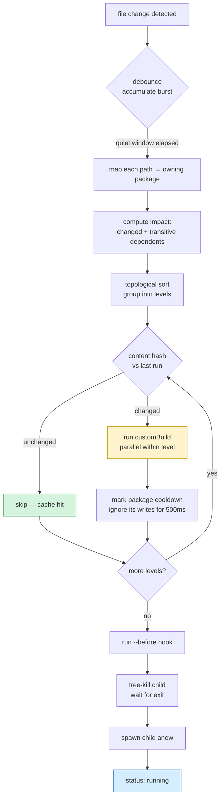
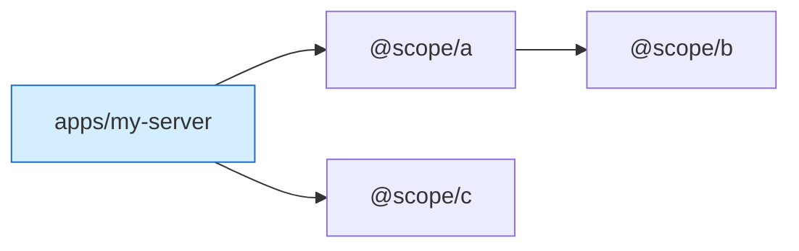

# monoripple

**A ripple across your monorepo.** A smart dev runner for Node.js monorepos: start your app with the usual command, and monoripple rebuilds + restarts it when you change code in the workspace packages it depends on — not just the app itself.

```bash
pnpm add -D @mono/ripple
pnpm exec monoripple init apps/my-server
pnpm exec monoripple
```

That's it. Edit a file in `packages/shared-lib` and your `apps/my-server` process restarts — with `shared-lib` rebuilt first if you told it to.

*(Package: [`@mono/ripple`](https://www.npmjs.com/package/@mono/ripple) · CLI binary: `monoripple`)*

---

## The problem it solves

In a pnpm / Yarn / npm workspace, apps live in `apps/*` and internal libraries live in `packages/*`. Your app imports the libraries; they're symlinked into `apps/my-server/node_modules/`.

Every dev watcher (`tsx watch`, `nodemon`, `next dev`, etc.) only watches **the app's own folder** and ignores `node_modules`. So when you edit a library, nothing happens. You restart the server by hand. Forever.

monoripple fixes this:
1. Finds your workspace packages
2. Resolves which ones your app *actually* depends on (direct + transitive)
3. Watches all of them
4. On change: optionally rebuilds the changed libraries in dependency order, then restarts your app

### Before vs. after

```
                 Without monoripple                  With monoripple
                 ──────────────────                  ───────────────

  my-repo/       ░ = not watched                     █ = watched
    apps/
      my-server/ █ src/, package.json                █ src/, package.json
        node_modules/
          @scope/lib   ░ (symlink — ignored)         █ (followed to real path)
    packages/
      lib/             ░                             █ src/, package.json
        src/           ░                             █
      util/            ░                             █ src/
```

With the normal watcher, edits in `packages/lib/src/index.ts` produce nothing. With monoripple, that edit → rebuild `lib` → restart `my-server`.

---

## Quick start

### 1. Install at the workspace root

```bash
pnpm add -D -w @mono/ripple
```

### 2. Generate a config next to your app

```bash
pnpm exec monoripple init apps/my-server
```

This writes `apps/my-server/monoripple.config.json`:

```json
{
  "$schema": "./node_modules/@mono/ripple/monoripple.config.schema.json",
  "command": "pnpm dev",
  "debounce": 200,
  "packages": {
    "@scope/shared-lib": { "customBuild": "pnpm run build" },
    "@scope/other-lib":  { "customBuild": "pnpm run build" }
  }
}
```

`init` auto-detects your app's workspace deps. Every package listed here gets `pnpm run build` run (from that package's folder) before the app restarts.

### 3. Run it

```bash
cd apps/my-server
pnpm exec monoripple
```

Or from anywhere in the repo:

```bash
pnpm exec monoripple apps/my-server
```

---

## Config file

```jsonc
{
  "$schema": "./node_modules/@mono/ripple/monoripple.config.schema.json",

  // App directory. Omit when the config lives inside the app folder.
  // At the workspace root, set it: "app": "apps/my-server"
  "app": "apps/my-server",

  // The dev command. String = run via shell. Array = direct spawn (safer).
  "command": "pnpm dev",
  // Equivalent: "command": ["pnpm", "dev"]

  // How long to wait after the last file change before restarting (ms)
  "debounce": 200,

  // Log every watch event
  "verbose": false,

  // Optional hook that runs once before every restart, from the repo root
  "before": "pnpm -w install",
  // Only run --before when a DEP changed (not the app itself)
  "beforeDepsOnly": false,

  // Max parallel customBuilds at the same topo level (default 4)
  "buildConcurrency": 4,
  // Per-package quiet window after a build completes (default 500ms)
  // Prevents build-output-triggers-watcher loops
  "cooldownMs": 500,
  // Child graceful-shutdown timeout before SIGKILL (default 10s)
  "killTimeoutMs": 10000,

  // Per-package hooks. `customBuild` runs when THIS package's files change,
  // before `--before` and before the restart.
  "packages": {
    "@scope/shared-lib": {
      // String (shell) or array (direct spawn)
      "customBuild": "pnpm run build",
      // "package" (default) = cwd is the package folder
      // "workspace-root" = cwd is the monorepo root
      "customBuildCwd": "package"
    }
  }
}
```

**Minimal config** — just the one required bit:

```json
{ "command": "pnpm dev" }
```

monoripple auto-detects your workspace deps and watches them. Without `packages[*].customBuild`, changes only restart (no rebuild).

---

## Where should the config live?

```
Per-app (recommended)                    Workspace root (mono-app repos)
─────────────────────                    ───────────────────────────────

my-repo/                                 my-repo/
├── apps/                                ├── monoripple.config.json  ← here
│   └── my-server/                       │   { "app": "apps/my-server",
│       └── monoripple.config.json  ←    │     "command": "pnpm dev", … }
│           { "command":"pnpm dev" }     ├── apps/
└── packages/                            │   └── my-server/
                                         └── packages/
```

| Layout | Best for |
|---|---|
| **Per-app** | Multi-app repos; config travels with each app; different teams own different apps |
| **Workspace root** | Single-app mono-repos; config at a predictable top-level location |

monoripple can be run from any subdirectory — it walks up to find the config. If you're at the repo root and the config lives inside an app, pass the app path: `monoripple apps/my-server`.

---

## CLI reference

```
monoripple [appDir] [options] [-- <command...>]
monoripple init [appDir] [--workspace-root]
monoripple doctor [appDir]
```

| Flag | Default | Purpose |
|---|---|---|
| `--debounce <ms>`, `-d` | 200 | Wait this long after a change before restarting |
| `--verbose`, `-v` | off | Log every watch event + debug lines |
| `--before "<cmd>"` | — | Run a shell command before every restart |
| `--before-deps-only` | off | Only run `--before` when a dep changed |
| `--interactive`, `-i` / `--no-interactive` | auto (TTY && !CI) | Keypress UI (r/b/d/v/p/c/q/?) |
| `--json` | off | NDJSON logs for CI, piping into `jq`, etc. |
| `--status` / `--no-status` | auto (TTY) | Persistent bottom status line |
| `--no-cache` | — | Skip content-hash cache (always rebuild) |
| `--cooldown <ms>` | 500 | Post-build quiet window per package |
| `--build-concurrency <n>` | 4 | Max parallel same-level customBuilds |
| `--no-gitignore` | — | Don't honor `.gitignore` in the watcher |
| `--allow-hooks` | — | Trust this config's hook commands (silences warning) |
| `--strict-hooks` | — | Refuse to run until `--allow-hooks` was passed once |
| `--allow-cjs-config` | — | Permit `.cjs` config files (they execute JS on load) |
| `--allow-hooks-js` | — | Load `monoripple.hooks.js` if present |
| `--kill-timeout <ms>` | 10000 | Graceful shutdown window before SIGKILL |
| `--dry-run` | — | Watch + log decisions; never spawn child or hooks |
| `--explain` | — | Print the decision tree at startup and exit |

### Interactive keys (when stdin is a TTY)

| Key | Action |
|---|---|
| `r` | Restart now |
| `b` | Restart, running `--before` first |
| `d` | Print watch roots + deps |
| `v` | Toggle verbose logs |
| `p` | Pause / resume file watching |
| `c` | Clear screen |
| `q` | Quit gracefully (Ctrl+C also works) |
| `?` or `h` | Show keybindings |

---

## How a restart actually works



The steps in plain English:

1. **Debounce** — buffer changes so a `git checkout` or formatter run counts as one burst
2. **Map to packages** — each changed path → its owning workspace package (or the app)
3. **Impact** — any package that depends on a changed one is also impacted (transitive closure up the graph)
4. **Build plan** — topologically sorted; independent packages at the same level run **in parallel** (up to `buildConcurrency`)
5. **Cache** — sha256 of source files + command; skip the build if it matches the last successful run
6. **Run builds** — stdout prefixed with `[pkg-name]`
7. **Cooldown** — per-package quiet window (`cooldownMs`) to suppress build-output-triggers-watcher loops
8. **`--before`** if configured
9. **Tree-kill** the child, wait up to `killTimeoutMs`, then respawn

Crash-driven restarts (child exited without being asked to) skip steps 3–8 and just restart immediately.

### Impact propagation: a worked example

Given this dependency graph:



| You edit a file in… | Build plan (topo order) | Why |
|---|---|---|
| `packages/b/src/…` | `b` → `a` | `a` depends on `b`, so it must rebuild too |
| `packages/c/src/…` | `c` | nothing depends on `c` |
| `packages/b/…` + `packages/c/…` | `b` + `c` in parallel → `a` | `b` and `c` are independent |
| `apps/my-server/src/…` | *(no builds)* | just restart |

---

## Diagnose it: `monoripple doctor`

Stuck on "why isn't my dep rebuilding"? Run:

```bash
pnpm exec monoripple doctor apps/my-server
```

Checks:
- Which config file would be loaded, from where
- Workspace deps declared but not installed (`pnpm install` reminder)
- Deps with a `build` script but no `customBuild` configured
- `node_modules` symlinks pointing to the wrong workspace path
- `src/` newer than `dist/` (initial build needed)
- `turbo.json` / `nx.json` coexistence notes

Exit code is non-zero if anything is broken.

---

## What-if mode: `--dry-run` + `--explain`

**`--dry-run`** runs the watcher but never spawns the child process or executes any hook:

```bash
pnpm exec monoripple --dry-run
# [dry-run] would start child pnpm dev
# change detected in packages/lib/src/index.ts → restarting…
# [dry-run] would run packages["lib"].customBuild ▸ pnpm run build
# [dry-run] would restart child
```

Great for debugging config without mutating state.

**`--explain`** prints the decision tree and exits:

```
when a file changes under:
  apps/my-server → skip builds, run --before, restart
  packages/lib
    → package: @scope/lib
    → customBuild: pnpm run build (cwd=packages/lib)
    → also rebuild (depends on @scope/lib): @scope/other-lib
  then: run --before (pnpm -w install) → restart child
```

---

## Performance: the input-hash cache

Every `customBuild` is gated by a content hash of the package's source files + the command. If nothing changed since the last successful build, we skip:

```
[monoripple] cache hit packages["@scope/lib"].customBuild (inputs unchanged)
```

Caches live at `<pkgRoot>/node_modules/.cache/monoripple/<key>.hash` so they're per-package and invalidate automatically on `pnpm install`. Disable with `--no-cache`.

Wall-clock impact on a 6-dep monorepo with `pnpm run build` taking ~1s each: a single-file edit drops from ~6s to ~50ms when no build actually runs.

---

## Security model

`customBuild` and `before` commands **execute shell** — they're arbitrary code. To prevent surprises:

1. **Startup warning** — the first time monoripple sees a config with hooks, it prints the exact commands and the flags to silence / harden:
   ```
   this config defines hook commands that will execute on file changes:
     packages["@scope/lib"].customBuild: pnpm run build
   pass --strict-hooks to require explicit trust, or --allow-hooks to silence this warning.
   ```
2. **`--allow-hooks`** records a sha256 fingerprint in `~/.cache/monoripple/acks.json`. Silent afterwards, until a hook body changes.
3. **`--strict-hooks`** refuses to start until an ack exists. Useful in CI.
4. **Array-form hooks** avoid the shell entirely:
   ```json
   { "customBuild": ["pnpm", "run", "build"] }
   ```
5. **`.cjs` configs** run arbitrary JS on load and are **refused by default**. Pass `--allow-cjs-config` or set `MONORIPPLE_ALLOW_CJS_CONFIG=1` to opt in.
6. **Configs outside the detected repo root** are rejected.

---

## JSON mode for CI and tooling

```bash
monoripple --json | jq '.'
```

Every log line + internal event becomes a structured NDJSON record:

```jsonc
{ "ts": "...", "level": "INFO", "event": "build:start", "fields": { "pkg": "@scope/lib", "command": "pnpm run build" } }
{ "ts": "...", "level": "INFO", "event": "build:end",   "fields": { "pkg": "@scope/lib", "ms": 412 } }
{ "ts": "...", "level": "INFO", "event": "restart:end", "fields": { "ms": 680 } }
```

Event types: `startup · burst · build:start|end|fail|cache-hit · before:start|end|fail · restart:start|end · child:start|crash · shutdown`.

---

## Custom JS hooks (opt-in)

Create `monoripple.hooks.js` next to your config, then run with `--allow-hooks-js`:

```js
// monoripple.hooks.js
module.exports = {
  onBuild(e) {
    if (e.type === "build:fail") notify.slack(`❌ ${e.pkg}: ${e.error}`);
  },
  onRestart(e) {
    if (e.type === "restart:end") metrics.record("restart_ms", e.ms);
  },
};
```

Supported handlers: `onStartup · onBurst · onBuild · onRestart · onCrash · onShutdown · onEvent` (catch-all). Thrown errors are caught and logged; they never crash the watcher.

---

## Troubleshooting

**"My dep changed but `customBuild` didn't run"**
The config isn't being loaded. monoripple walks **up** from the current directory and, failing that, tries the positional appDir you passed. Confirm with:
```
pnpm exec monoripple doctor apps/my-server
```
Look for `config found at: …`.

**"Nothing happens when I edit a file"**
Maybe the file matches `.gitignore` (watcher honors it by default). Try `--no-gitignore`, or check `--verbose` to see which events are firing.

**"It restarts in a loop"**
Your build is writing into its own watched source. Either:
- Increase `--cooldown <ms>` (default 500),
- Add the output directory to `.gitignore`, or
- Point the build's output to `dist/` (already ignored).

**"`pnpm install` finished but new deps aren't watched"**
Restart monoripple — it builds the dep graph at startup.

---

## Migrating from `dep-watch` / `wokspace-watch`

`@mono/ripple` is the continuation of the `dep-watch` / `wokspace-watch` package. Your existing setups keep working:

| Old | New | Status |
|---|---|---|
| `dep-watch` / `wokspace-watch` CLI | `monoripple` (also `ripple`) | Old binary names still work as aliases |
| `dep-watch.config.json` | `monoripple.config.json` | Old filename still read; rename at your leisure |
| `dep-watch.hooks.js` | `monoripple.hooks.js` | Old filename still loaded |
| `DEP_WATCH_ALLOW_CJS_CONFIG` | `MONORIPPLE_ALLOW_CJS_CONFIG` | Both accepted |
| `~/.cache/wokspace-watch/` | `~/.cache/monoripple/` | Fresh start; old acks not migrated (re-ack with `--allow-hooks` once) |
| `node_modules/.cache/wokspace-watch/` | `node_modules/.cache/monoripple/` | Fresh start; first build after upgrade rehashes |

To finish migrating: rename your config file, update any npm scripts to call `monoripple`, and clear `~/.cache/wokspace-watch/` if you want a clean slate.

---

## Programmatic API

```ts
import {
  buildWorkspaceGraph,
  createWatcher,
  DevRunner,
  resolveWorkspaceContext,
} from "@mono/ripple";

const ctx = resolveWorkspaceContext("/repo/apps/my-server");
const graph = buildWorkspaceGraph("/repo/apps/my-server", ctx);
// graph.deps, graph.dependsOn, graph.dependents, graph.topoOrder
```

Also exported: `createEventBus`, `runDoctor`, `computeInputHash` / `readLastHash` / `writeHash`, `loadGitignore`, `runPool` / `groupIntoLevels`, `validateConfig`.

---

## Command name aliases

All of these resolve to the same binary (installed once, reachable as any of them):

| Command | When to use |
|---|---|
| `monoripple` | **Primary.** Matches the npm package name. |
| `ripple` | **Short.** Easy to type; may collide with other tools if globally installed. |
| `dep-watch` / `wokspace-watch` / `workspace-watch` | **Legacy aliases** — kept so existing scripts keep working. |

With pnpm workspaces:

```bash
pnpm add -D -w @mono/ripple
pnpm -w exec monoripple apps/my-server
```

---

## What it does NOT do

- **No bundling / transpiling** — monoripple doesn't run tsc, esbuild, etc. It orchestrates the commands you already use.
- **No HMR** — it's a full-process restart tool. Pair with your dev server's HMR if you have it.
- **No hot-patching node_modules** — it watches the real package locations on disk (via realpath of the symlinks).

---

## License

MIT
